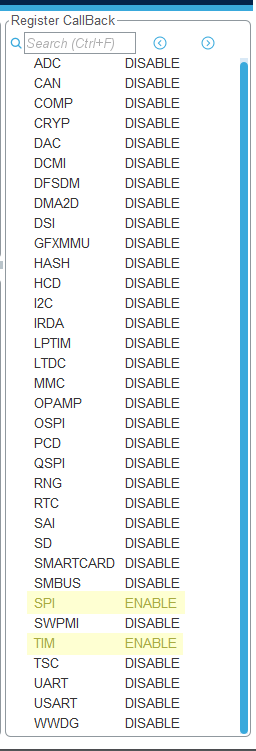

<a name="readme-top"></a>
<summary>Table of Contents</summary>
<ol>
<li>
    <a href="#about">About</a>
</li>
<li><a href="#running-examples">Running Examples</a></li>
<li><a href="#configuring-a-new-project">Configuring A New Project</a></li>


## About
stm32_APA102 is a C++ library for APA102 led pixel tape using cube HAL.  

It contains two examples, `APA102_driver_basic_example` demonstrating the basic functionality of the driver,
and `APA102_driver_animations_example` which utilizes a timer peripheral to create some animations.
<p align="right">(<a href="#readme-top">back to top</a>)</p>

## Running Examples
The examples are compiled for an stm32l476RGT.

If a stm32l476RGT is being used, from within stm32CubeIDE:    
`file->import`, then select `Existing Projects into Workspace`, then browse to the respective example folder and click next.

If you are not using an stm32l476RGT:  
Follow the directions in the [Configuring A New Project](#configuring-a-new-project) then copy
and paste the `main_cpp.cpp` of the respective example to `your_project/core/src` and `main_cpp.h` to `your_project/core/inc`.   

Next, edit the `main.c` file to include the `main_cpp.h` header and call the `cpp_main()` function:  

```cpp
/* Private includes ----------------------------------------------------------*/
/* USER CODE BEGIN Includes */
#include "main_cpp.h"

//...

//farther below after MX_init functions
  /* USER CODE BEGIN 2 */
  //jump to cpp program
  cpp_main();
  /* USER CODE END 2 */
```
<p align="right">(<a href="#readme-top">back to top</a>)</p>

## Configuring A New Project

**1.**    
    Open STM32CubeIDE and create a new project (`file->new->stm32_project`).  

**2.**    
    Find your controller from the list and hit next to proceed to the project window.  

**3.**    
    Select `C++` from `Targeted Language` and enter your project name on the STM32 project window.  
      

**4.**  
    From the `your_project.ioc` pinout and configuration file, first select the `Clock Configuration`.  
    We want around 16 to 20MHz for our SPI SCLK, as long as you can derive that from your HCLK. Here,
    I am using 80MHz:  
      

**5.**  
    Next, select your desired SPI peripheral from `Pinout & Configuration`.  
    Set the Mode to Transmit Only Master, Data Size to 8 bits, CPOL to high, CPHA to 2 Edge (SPI mode 3), and the Prescaler to a suitable divisor to achieve 16 - 20MHz on SCLK.  
      

**5.**  
    From the `DMA settings` tab of the same spi peripheral, add a request for SPIX_TX (in this case SPI1) by clicking the add button.  
    Set the priority to high/very high, if possible.  
      

**6.**  
    If you are not using the animations, skip to step  **10**.

**7.**  
Select a timer peripheral to use for driving the animations from `Pinout & Configuration` and set the Prescaler to achieve a 20MHz
tick frequency (in this case, 4), alternatively, replace *TIM_TICK_FREQ* in `APA102Animation.h` with your used tick frequency.  
 

**8.**  
Select the `NVIC Settings` tab of the same timer peripheral and enable its respective interrupt.  


**9.**  
From `Project Manager` select the `Advanced Settings` tab and enable `Register CallBack` on `TIM`:  
 

**10.**     
From `Project Manager` select the `Code Generator` and check `'.c/.c' files per peripheral`. 
 

**11.**     
Hit `ctrl+s` to save and generate code.  

**12.**     
Select `project->properties` and click the `Settings` menu underneath the `C/C++ Build` drop down.  
In `MCU/MPU G++ Compiler` set the Language Standard to C++ 20.    
 

**13.**     
Copy and paste the `Inc` and `Src` from the repo `APA102_driver` folder into `your_project/Core`  
<p align="right">(<a href="#readme-top">back to top</a>)</p>